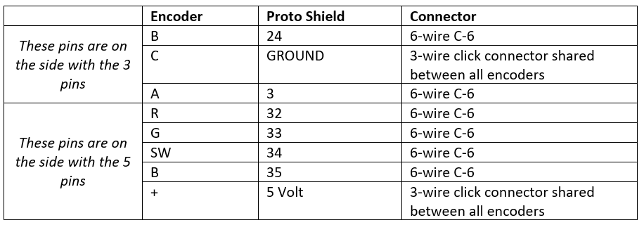

#EvalMe: Exploring the Value of New Technologies for In Situ Evaluation of Learning Experiences

Repository accompanying the ACM CHI 2021 publication **EvalMe: Exploring the Value of New Technologies for In Situ Evaluation of Learning Experiences.** 
Auhtors: *Susan Lechelt, Frederik Brudy, Nicolai Marquardt, Yvonne Rogers.*
Published in Proceedings of the ACM Conference on Human Factors in Computing Systems 2021 (ACM CHI '21), May 8–13, 2021, Yokohama, Japan.
DOI: https://doi.org/10.1145/3411764.3445749

#Contents
- [EvaleMe-Desktop](EvaleMe-Desktop) contains the code for the Electron app for the EvalMe Desktop application
- [EvalMe-Hardware](EvalMe-Hardware) contains the Arduino code for both Sender and Receiver
  - [EvalMe-encoderButton-Neopixelring-rf95-client-Mega.V2](EvalMe-Hardware\EvalMe-encoderButton-Neopixelring-rf95-client-Mega.V2) is the code for the sender
  - [EvalMe-rf95_reliable_datagram_server.V2](EvalMe-Hardware\EvalMe-rf95_reliable_datagram_server.V2) is the code for the receiver
  - [Case-Receiver](EvalMe-Hardware/Case-Receiver) contains the 3D printing files for the receiver case. 
  - [Case-Sender](EvalMe-Hardware/Case-Sender) contains the 3D printing files for the sender case.

# EvalMe hardware

The system consists of two parts, one Sender (large box) and one Receiver part (small box) as described in the publication. The receiver is simply an Arduino Uno, with a LoRa shield stacked on top of it, and mounted to the bottom part of the small box.

The sender needs more assembling, which is detailed below.

It might make sense to assemble some / all of these on a breadboard before soldering and test whether the code and hardware is working correctly.

## Parts for sender

The sender device consists of multiple components:

- Arduino Mega
- RFID Module (Adadfruit PN532 Breakout Board)
- PowerBoost 1000C
- Toggle switch for power
- 3x 12 LED Neopixel rings
- 3x Rotary Encoder with RGB LED and pushbutton
- Arduino Mega ProtoShield to solder the connections
- LoRa shield. Stacks on top of the Mega Proto Shield.
- Push button
- 5mm blue LED and silver LED holder. 100 Ohm+ resistor
- Several 2-wire click connectors (for LED, PowerBoost Enable, PowerBoost-to-Arduino connection, pushbutton)
- Several 3-wire click connectors (for 5V and GND for rotary encoder, Neopixel rings)
- Several 6-wire click connectors (for data connection for rotary encoder, RFID shield)

## Cases
The 3D printing files can be found in [Case-Receiver](EvalMe-Hardware/Case-Receiver) as well as [Case-Sender](EvalMe-Hardware/Case-Sender)

## General structure
The Arduino Mega and the PowerBoost are screwed to the bottom part of the Sender casing. There are mounts in the base for both. Small screws should be used.

The proto shield (see below) is stacked on top of the Arduino. The LoRa shield is stacked on top of the proto shield.

The RFID module is placed upright towards the front where the RFID symbol is. Use e.g. double-sided tape or Velcro to hold it in place. The battery is placed behind the RFID module.

A large blue LED is screwed with the silver LED mount to the hole to the left of the RFID symbol. Connect using a minimum 100 Ohm resistor between LED and power.

A push button is connected to the right of the RFID symbol. 

The connections between the Proto Shield and all other components should be made with click-connectors. They are either 2-wire, 3-wire, or 6-wire and have a male and female part. The wires coming from e.g. the female connector are soldered to the proto shield, the wires coming from e.g. the male connector are soldered to the components.
 The connection holes for the wires on each side are labelled with numbers on the back that correspond to the same connection on the other clip. You need to crimp the wires and clip then into the male/female connectors. 

## Proto Shield

Generally, all connections to components should be made through the Proto Shield (see image above). Sacking headers must be soldered to the Proto Shield. Stacking headers (see following image) are the ones with long legs at the bottom (to stack on top of the Arduino), and female connectors at the top (to stack other shields on top, i.e. the LoRa shield).

The stacking headers are soldered to the rows / columns of through-holes marked in red &quot;Stack&quot; above (basically so that they&#39;ll stack properly on top of the Arduino). Wires connecting to the click-connectors (which then connect to other components) are then soldered to the through-holes marked with &quot;Solder&quot;.

Note that the Proto Shield has many through-holes connected to GND and 5V on the left (marked with the red rectangle). These can be used to connect the GND and 5V of pushbuttons, LED rings, and RFID board, etc.

Note the block in the front, that&#39;s the one to use for the centre connection of the LoRa module (see description below).

## LoRa shield

The LoRa shield is stacked on top of the Proto Shield. The LoRa shield requires the six pins in the middle of the board (circled in red below, labelled with ICSP) to connected to the Arduino as well, so these headers must be soldered to the Proto Shield as well. There are 2x3 headers (see image above) that fit here. **Attention:** Here the female connectors are facing down towards the Arduino board and the male pins are facing up—that&#39;s the opposite way as all other pins, so the headers must be adjusted accordingly.

## PowerBoost 1000C

Connect the GROUND and ENable pin on the PowerBoost to the toggle switch. This allows to turn the 5V output of the PowerBoost off/on. There should be black switches that fit nicely into the side-plate of the large case. Note: It might be that the labelling on the switch is inverted to the behaviour of the PowerBoost (i.e. when the switch is set to I the output is off, when set to O the output is on). In this case carefully use a carpenter knife and scratch out the labelling on the button.

Connect the other GND of the PowerBoost to the Arduino GND and the 5V to Vin on the Arduino ( **NOT** to 5V on the Arduino).

PowerBoost GND -> One toggle switch pin
 PowerBoost EN -> Other toggle switch pin
 Make these connections using a 2-wire click connector

PowerBoost GND -> Arduino GND
 PowerBoost 5V -> Arduino Vin
 You can make the 5V/GND connection using jumper wires or a 2-wire click connector

You might need to solder headers on to the PowerBoost.

Make sure you&#39;re using the 1000C, not the 500 and not the basic. The C indicates Charger, so it has a micro USB connection to charge the connected battery and/or power directly without a battery. Connect the battery only after you finished the general assembly of everything.

Some of the PowerBoosts are faulty and the LED labelled LOW lights up when the output is switched to off (not to be confused with the CHARGE LED). In this case gently cut the connection of the LOW LED using a carpenter knife or similar to turn it off entirely.

## Rotary encoders

Not all the encoders are yet soldered to the breakout boards. When assembling them please note that the red breakout boards are two-sided, labelled RG and RGB. We have RGB LEDs inside the pushbuttons, so use the RGB side: When assembling the rotary encoders / pushbuttons they should be inserted into the RGB side of the breakout board. In other words, when holding the button/encoder normally up, the RGB side of the breakout board is facing up. Some of them are already assembled, so just check how it&#39;s done there.

The following indicates the connections from the encoders to the Arduino.
 For the GND and 5V connections you can use a 3-wire click connector shared between the three encoders. For the other connections you can use a 6-wire click connector fore each button.
 For example, the 6-wire A-1 connector means a 6-wire click connector A, hole 1.

### Button 1

|                                            | Encoder | Proto Shield | Connector                                          |
|--------------------------------------------|---------|--------------|----------------------------------------------------|
| These pins are on the side with the 3 pins | B       | 22           | 6-wire A-1                                         |
|                                            | C       | GROUND       | 3-wire click connector shared between all encoders |
|                                            | A       | 18           | 6-wire A-2                                         |
| These pins are on the side with the 5 pins | R       | 15           | 6-wire A-3                                         |
|                                            | G       | A14          | 6-wire A-4                                         |
|                                            | SW      | 14           | 6-wire A-5                                         |
|                                            | B       | 16           | 6-wire A-6                                         |
|                                            | +       | 5 Volt       | 3-wire click connector shared between all encoders |

<!---->

### Button 2
|                                            | Encoder | Proto Shield | Connector                                          |
|--------------------------------------------|---------|--------------|----------------------------------------------------|
| These pins are on the side with the 3 pins | B       | 23           | 6-wire B-6                                         |
|                                            | C       | GROUND       | 3-wire click connector shared between all encoders |
|                                            | A       | 19           | 6-wire B-6                                         |
| These pins are on the side with the 5 pins | R       | 29           | 6-wire B-6                                         |
|                                            | G       | 28           | 6-wire B-6                                         |
|                                            | SW      | 31           | 6-wire B-6                                         |
|                                            | B       | 30           | 6-wire B-6                                         |
|                                            | +       | 5 Volt       | 3-wire click connector shared between all encoders |

<!-- --> 

### Button 3

|                                            | Encoder | Proto Shield | Connector                                          |
|--------------------------------------------|---------|--------------|----------------------------------------------------|
| These pins are on the side with the 3 pins | B       | 24           | 6-wire C-6                                         |
|                                            | C       | GROUND       | 3-wire click connector shared between all encoders |
|                                            | A       | 3            | 6-wire C-6                                         |
| These pins are on the side with the 5 pins | R       | 32           | 6-wire C-6                                         |
|                                            | G       | 33           | 6-wire C-6                                         |
|                                            | SW      | 34           | 6-wire C-6                                         |
|                                            | B       | 35           | 6-wire C-6                                         |
|                                            | +       | 5 Volt       | 3-wire click connector shared between all encoders |

<!---->

After assembling, uploading the code, and testing the mapping of the rotary encoder to the NeoPixel rings you might need to switch around which click connector from which button connects to which corresponding connector on the proto shield. But that&#39;s just a matter of flipping them to another.

## RFID module

Use the following PIN mapping. Images below indicate the pins on the RFID module. Use a 6-wire click connector.

| **RFID module PIN** | **Arduino PIN / Proto Shield** |
| --- | --- |
| 2 | 46 |
| 3 | 47 |
| SDA (3 pins to the right of PIN 13) | 20 (SDA) |
| SCL (next to the above) | 21 (SCL) |
| GND | GND (can be to the dedicated GND section on the left of the proto shield) |
| 5V | 5V (can be to the dedicated GND section on the left of the proto shield) |

## NeoPixel LED rings

There are 3 NeoPixel rings with 12 LEDs each. They are connected in series to Arduino PIN 40, 5V, and GND. To allow assembly, there should be a 3-wire click connector used between each of them, so that DO (data out) of the previous ring is connected to DI (data in) of the next.

Arduino PIN 40 -> Ring 1 DI (data in)

Ring 1 DO (data out) -> Ring 2 DI

Ring 2 DO -> Ring 3 DI

5V &amp; GND from Arduino to the first ring 5v&amp;GND next to DI.
 5V &amp; GND next to DO of ring 1 then to the 5V and GND next to the DI of the ring 2 and so on.

Use small screws to mount the rings to the case. You might need to drill one of the holes again, as the holes on the case might not fit perfectly. **Note:** When using metal screws, they might short circuit two of the pixels and cause a reset of the Arduino / erratic behaviour. Use small drops of superglue to create a small plastic film over the metal parts that are touched by the screws. Let it dry and then insert the screws. I have done this already for the rings used in the half-assembled prototype.

## Pushbutton and LED

A large (5mm) blue LED is screwed with the silver LED mount to the hole to the left of the RFID symbol. Add a minimum 100 Ohm resistor between LED and Arduino.

A push button is connected to the right of the RFID symbol. Use one with a flat backside, not the one that sticks out \&gt;3cm. There should be one ready on the desk. No resistor needed for the button

| **Part** | **Arduino / Proto Shield** |
| --- | --- |
| LED short leg | GND (add a >100 Ohm resistor in series) |
| LED long leg | 38 |
| Button PIN 1 | 42 |
| Button PIN 2 | GND |

Code for the Arduino can be found in the folder [EvalMe Hardware](EvalMe Hardware)

Once everything is assembled, upload code as follows:

- [EvalMe-encoderButton-Neopixelring-rf95-client-Mega.V2](EvalMe-Hardware\EvalMe-encoderButton-Neopixelring-rf95-client-Mega.V2) to the Arduino Mega in the Sender
- [EvalMe-rf95_reliable_datagram_server.V2](EvalMe-Hardware\EvalMe-rf95_reliable_datagram_server.V2) to the Arduino Uno in the Receiver

You can test it by opening the serial monitor on the receiver / Uno and power up the sender. Then enter the following text in serial monitor and send it to the Arduino Uno:

`REQUIRE_NO_AUTH` and `SET_COUNTER_MAX:12` 
This will set some initial parameters in the Mega's EEPROM.
 Afterwards play around with the encoders to check whether the LED&#39;s on the rings light up correctly. Press the button to send the data. It should be displayed in the Serial Monitor on the receiver / Uno.

To test the RFID, send the following to the receiver's / Uno's serial monitor `REQUIRE_AUTH` 
 All LEDs on top of the sender should turn off and the blue LED should blink. Use e.g. your student ID card to &quot;log in&quot; and then the encoders are usable.

## License
MIT license

**EvalMe: Exploring the Value of New Technologies for In Situ Evaluation of Learning Experiences.**
*Susan Lechelt, Frederik Brudy, Nicolai Marquardt, Yvonne Rogers.*
Published in Proceedings of the ACM Conference on Human Factors in Computing Systems 2021 (ACM CHI '21), May 8–13, 2021, Yokohama, Japan.
DOI: https://doi.org/10.1145/3411764.3445749
